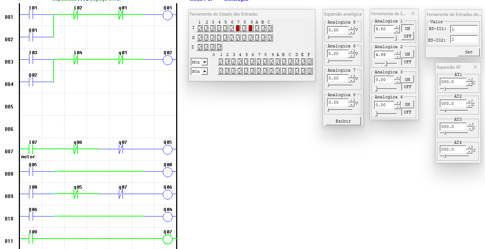
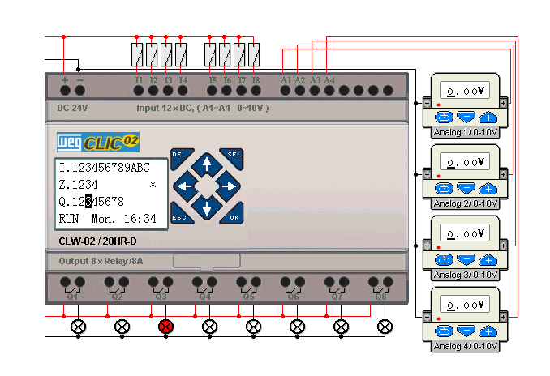

# Introdução ao CLICK02 – Programação Ladder

## 📖 Sobre o projeto
Este repositório contém um exemplo simples de **programação Ladder utilizando o CLP CLICK02**.  
O objetivo é demonstrar conceitos básicos de **lógica de controle industrial**, como:

- Contatos normalmente abertos e fechados
- Bobinas de saída
- Intertravamento lógico
- Controle básico de motor
- Estrutura de redes (rungs)

O projeto foi criado como material de **estudo e introdução à automação industrial com Ladder**.

---

## ⚙️ Tecnologias utilizadas

- **CLP:** CLICK02  
- **Linguagem:** Ladder Diagram (LD)  
- **Software:** CLICK Programming Software  

---

## 🧠 Conceitos demonstrados

O programa mostra alguns conceitos fundamentais de CLP:

- **Entradas digitais (Ixx)**  
  Sensores ou botões conectados ao CLP.

- **Saídas digitais (Qxx)**  
  Dispositivos acionados pelo CLP, como motores ou lâmpadas.

- **Contatos NA e NF**  
  Utilizados para criar condições lógicas.

- **Bobinas (Outputs)**  
  Responsáveis por ativar dispositivos.

---

## 🔧 Exemplo de lógica implementada

O sistema demonstra um exemplo simples de controle:

- Um **motor é acionado** quando determinadas condições são atendidas.
- Existem **condições de bloqueio (interlock)** para evitar conflitos.
- Algumas saídas dependem do estado de outras.

Isso simula situações comuns em automação industrial.

---

## 🖼 Exemplo do programa Ladder

*(Imagem ilustrativa do programa Ladder utilizado no projeto.)*

